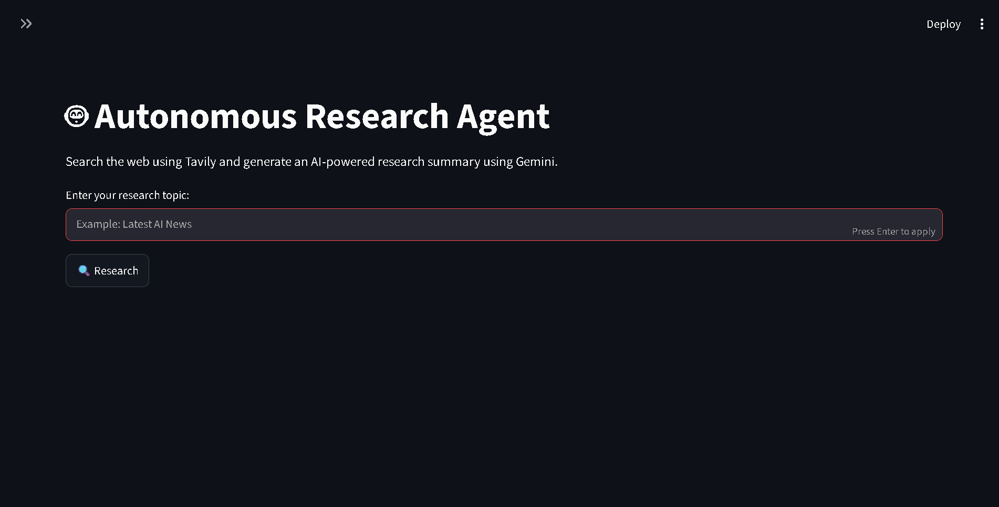
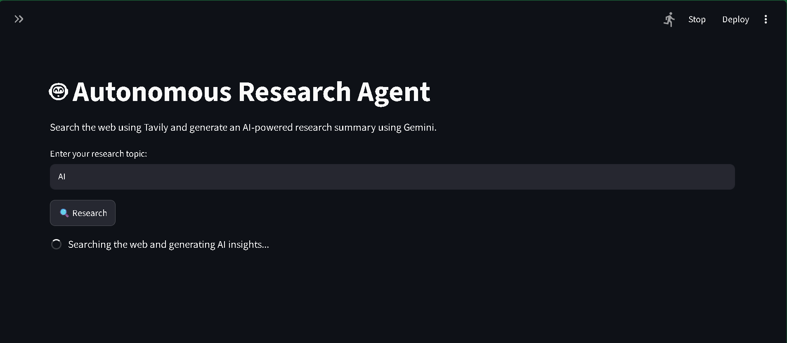
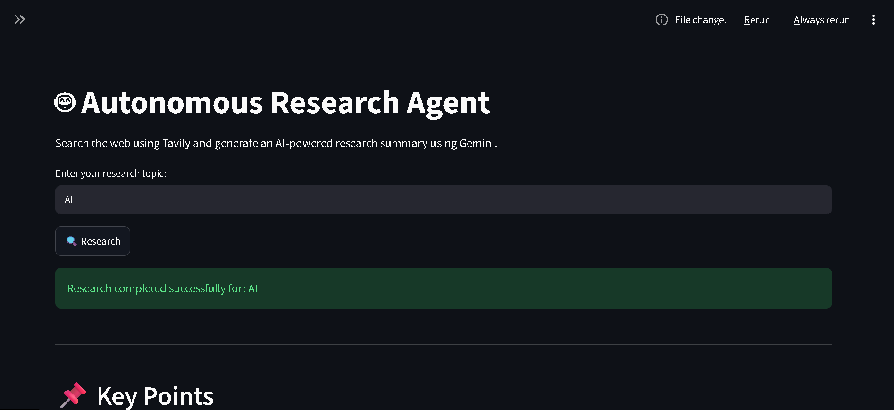
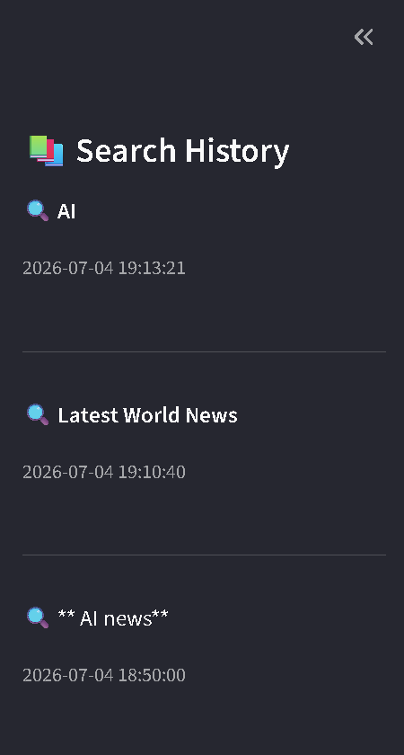
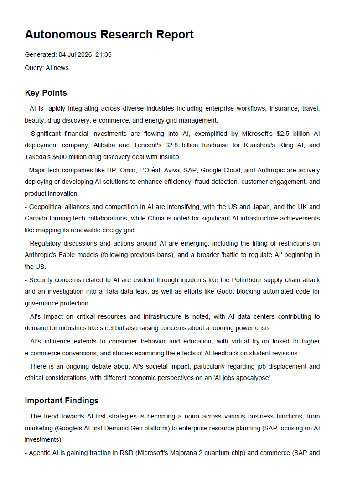
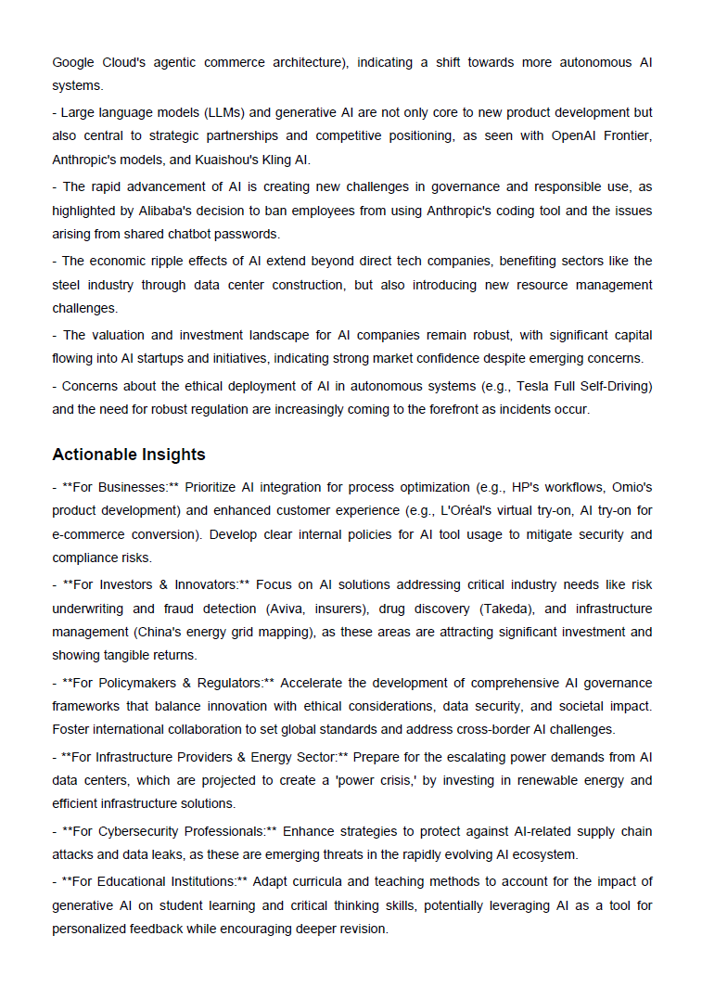
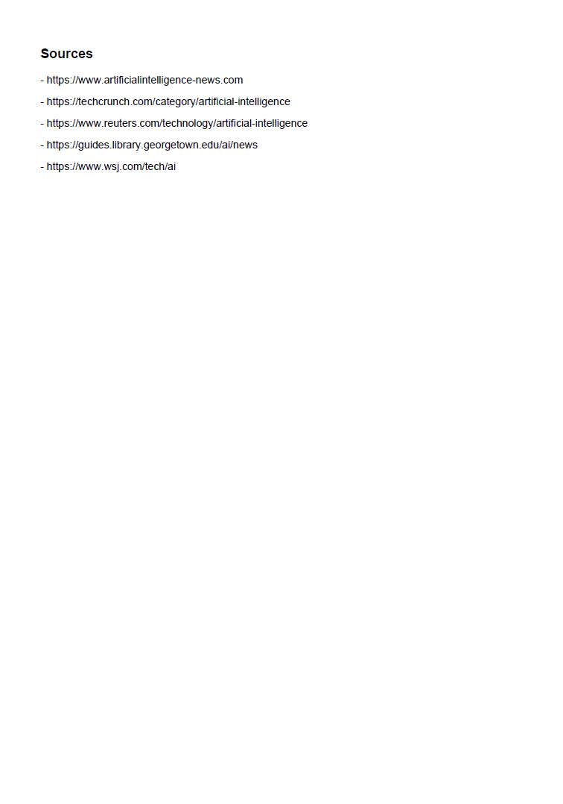

<div align="center">

# 🔎 Autonomous Research Agent

### AI-powered research assistant that autonomously searches the web, synthesizes information, and generates professional research reports.

[](https://python.org)
[](https://streamlit.io)
[](https://ai.google.dev)
[](https://tavily.com)
[](LICENSE)

**Built as an autonomous AI system capable of researching any topic, removing redundant information, generating actionable insights, and exporting professional reports in PDF and Markdown.**

</div>

---

## 📖 Overview

Researching a topic manually requires searching multiple sources, filtering duplicate information, identifying key insights, and organizing everything into a structured report.

This project automates that entire workflow.

Given any research topic, the agent autonomously:

- Searches the web via Tavily Search API
- Gathers and aggregates relevant information from multiple sources
- Removes duplicate and redundant content before analysis
- Synthesizes findings using Google Gemini 2.0 Flash
- Generates actionable insights and recommendations
- Exports professional PDF and Markdown reports
- Stores previous searches for future reference

The result is a complete research assistant — not a chatbot.

---

## ✨ Features

| Capability | Description |
|------------|-------------|
| 🌐 Autonomous Web Research | Searches the web using Tavily Search API |
| 🧠 AI Analysis | Uses Gemini 2.0 Flash to synthesize information |
| 📚 Multi-Source Aggregation | Pulls and combines results from multiple sources |
| 🚫 Duplicate Removal | Eliminates redundant content before analysis |
| 💡 Actionable Insights | Produces recommendations, not just summaries |
| 📄 PDF Export | Generates professional, formatted research reports |
| 📝 Markdown Export | Saves reports in portable Markdown format |
| 🕘 Search History | Persists previous research sessions locally |
| 🎨 Streamlit Interface | Clean, interactive UI with no configuration required |
| ⚡ Fast Execution | Complete research workflow in under 30 seconds |

---

## 🏗 Architecture

```
                User Query
                     │
                     ▼
         Autonomous Research Planner
                     │
                     ▼
          Tavily Web Search API
                     │
                     ▼
         Content Collection Layer
         (multi-source aggregation)
                     │
                     ▼
      Duplicate & Noise Removal
                     │
                     ▼
      Gemini 2.0 Flash Analysis
                     │
                     ▼
      Structured Research Report
                     │
        ┌────────────┴────────────┐
        ▼                         ▼
   PDF Export              Markdown Export
        │                         │
        └────────────┬────────────┘
                     ▼
              Search History
```

---

## ⚙️ Tech Stack

| Layer | Technology |
|--------|------------|
| Language | Python 3.11+ |
| Frontend | Streamlit |
| LLM | Google Gemini 2.0 Flash |
| Search Engine | Tavily Search API |
| PDF Generation | ReportLab |
| Markdown Export | Python Markdown |
| Environment | python-dotenv |
| Dependency Manager | uv (pip also supported) |

---

## 📂 Project Structure

```text
autonomous-research-agent/
│
├── app.py                    # Streamlit entry point
├── requirements.txt          # pip dependencies
├── pyproject.toml            # uv project config (requires-python = ">=3.11")
├── uv.lock                   # locked dependency tree
├── .env.example              # environment variable template
│
├── services/
│   ├── research_service.py   # Tavily search + content aggregation
│   ├── pdf_service.py        # ReportLab PDF generation
│   ├── markdown_service.py   # Markdown export
│   └── history_service.py    # Search history persistence
│
├── tests/
│   └── test_app.py
│
├── screenshots/
├── reports/
└── README.md
```

---

## 🚀 Installation

### Option 1 — uv (Recommended)

```bash
git clone https://github.com/<username>/autonomous-research-agent.git
cd autonomous-research-agent
uv sync
```

> Requires Python 3.11+. uv resolves and installs all dependencies from `uv.lock` in seconds.

---

### Option 2 — pip

```bash
git clone https://github.com/<username>/autonomous-research-agent.git
cd autonomous-research-agent
pip install -r requirements.txt
```

---

## 🔑 Environment Variables

Copy `.env.example` and fill in your API keys:

```bash
cp .env.example .env
```

```env
GOOGLE_API_KEY=your_google_api_key
TAVILY_API_KEY=your_tavily_api_key
```

Get your keys here:
- [Google AI Studio](https://aistudio.google.com/app/apikey) — free tier available
- [Tavily](https://tavily.com) — free tier available (1000 searches/month)

---

## ▶ Running the Application

```bash
streamlit run app.py
```

The application will open automatically in your browser at `http://localhost:8501`.

---

## 🖥 Screenshots

### Home Page


### Research in Progress


### Research Results


### Search History


### Generated PDF Report




---

## 🔄 Workflow

```
User enters research topic
            │
            ▼
Tavily Web Search (multi-source)
            │
            ▼
Collect & Deduplicate Sources
            │
            ▼
Gemini 2.0 Flash Analysis
            │
            ▼
Generate Structured Summary
            │
            ▼
Extract Actionable Insights
            │
            ▼
Export PDF + Markdown Report
            │
            ▼
Save to Search History
```

---

## 🎯 Design Decisions

### Why Gemini 2.0 Flash?

Gemini 2.0 Flash offers strong reasoning and summarization at low latency with a generous free tier — making it practical for both local development and deployment without cost concerns at this scale.

### Why Tavily?

Tavily is purpose-built for AI applications. Unlike general-purpose search APIs, it returns pre-cleaned, relevant results that require minimal preprocessing — reducing prompt size and improving output quality.

### Why Streamlit?

Streamlit allows rapid iteration on the UI without context-switching into frontend frameworks. For an AI tool where the core value is the pipeline logic, not the interface, this is the right tradeoff.

### Why uv?

`uv` provides reproducible environments via `uv.lock` and installs significantly faster than pip. The `pyproject.toml` also enforces `requires-python = ">=3.11"`, preventing silent version mismatch bugs.

### Why no LangChain or agent frameworks?

The pipeline is simple enough that adding a framework would introduce unnecessary abstraction. Direct API calls to Tavily and Gemini keep the code readable, debuggable, and dependency-light.

---

## ⚡ Performance

| Stage | Average Time |
|---------|-------------|
| Tavily Web Search | 3–6 seconds |
| Gemini AI Analysis | 5–10 seconds |
| PDF Generation | < 1 second |
| Markdown Export | < 1 second |
| **Total** | **~10–20 seconds** |

*Varies with network latency and query complexity.*

---

## ✅ Project Highlights

- Autonomous research workflow requiring zero manual source selection
- Multi-source web search with deduplication before LLM context
- Modular service architecture — each concern isolated to its own module
- Professional PDF export with structured sections
- Persistent search history across sessions
- No external agent framework dependencies
- Unit tests included

---

## 🔮 Future Improvements

- **Multi-agent architecture** — separate Search, Analysis, and Critique agents with independent reasoning steps
- **Vector memory** — ChromaDB integration for persistent research memory and cross-session retrieval
- **Source confidence scoring** — rank sources by relevance using embedding similarity before analysis
- **Parallel search providers** — combine Tavily, SerpAPI, and DuckDuckGo for broader coverage
- **Scheduled research** — automated topic monitoring with diff-based updates
- **Multi-language reports** — generate reports in regional languages via Gemini's multilingual capabilities

---

## 🙏 Acknowledgements

- [Google Gemini](https://ai.google.dev)
- [Tavily Search](https://tavily.com)
- [Streamlit](https://streamlit.io)
- [ReportLab](https://www.reportlab.com)
- Python Open Source Community

---

## 📄 License

This project is licensed under the [MIT License](LICENSE).

---

<div align="center">

**⭐ If you found this project useful, consider giving it a star!**

</div>